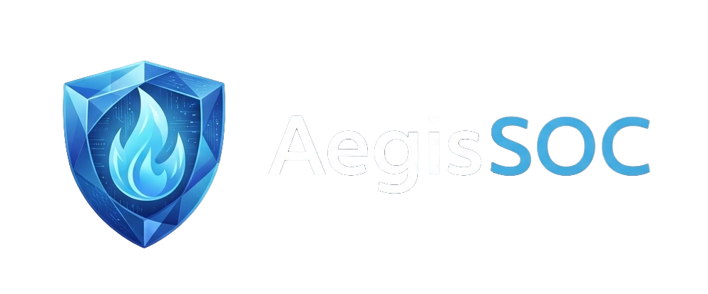
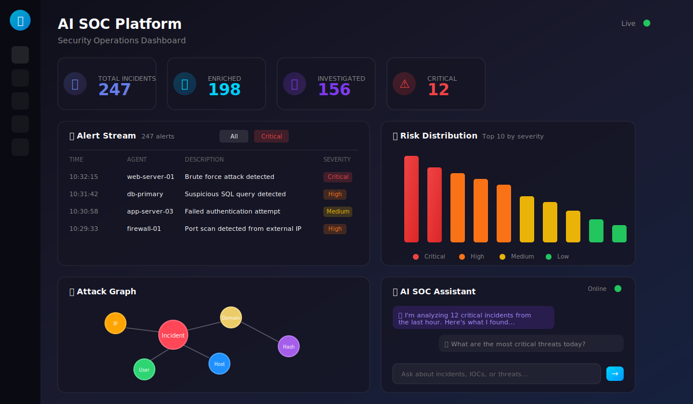
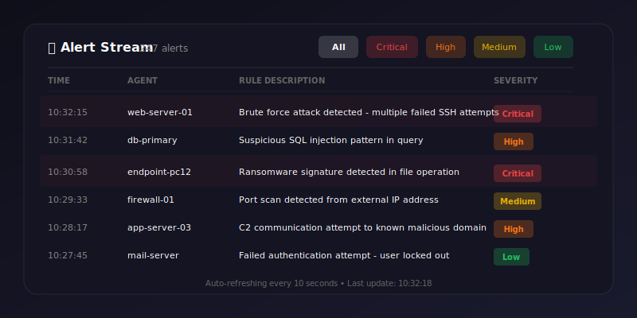
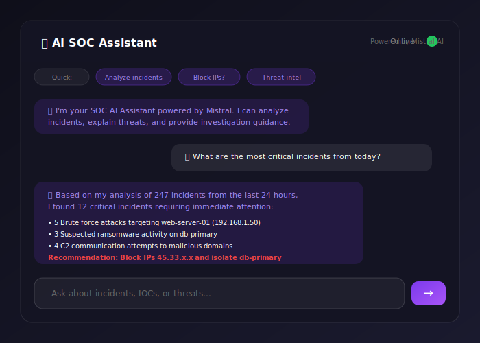
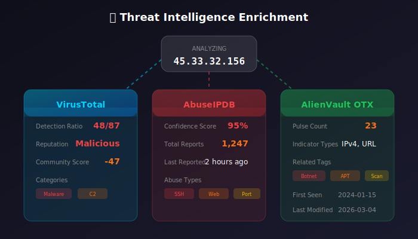
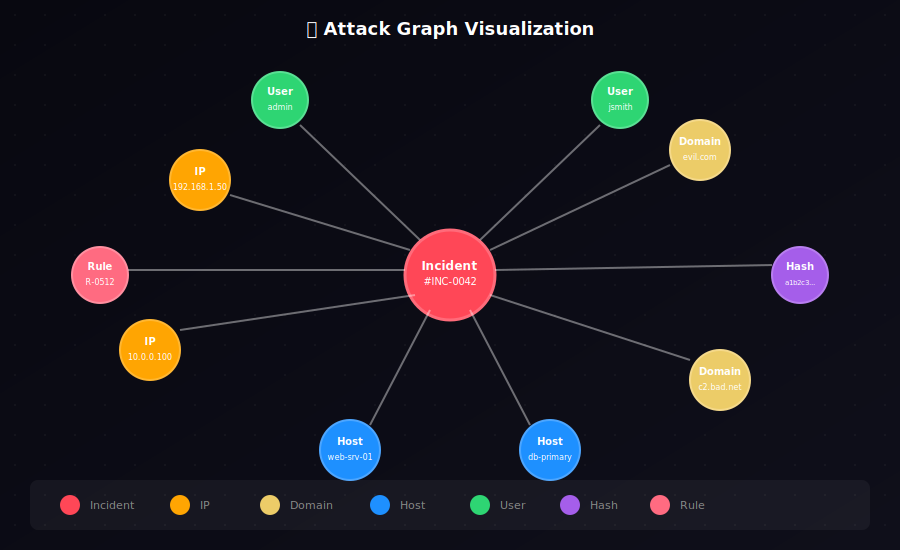
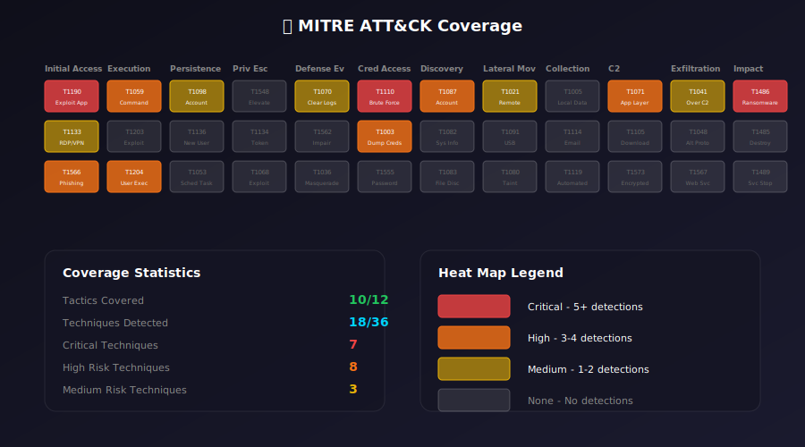
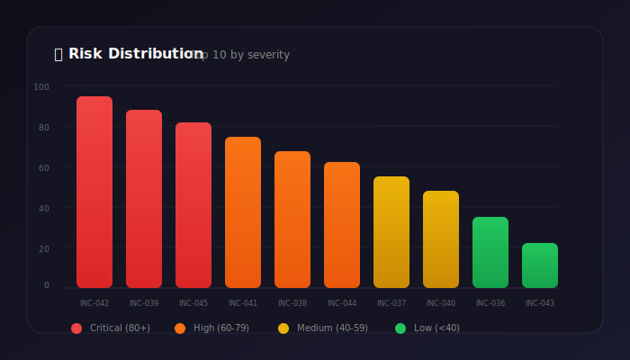
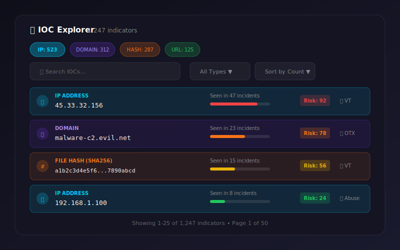

<div align="center">



### Production-Grade AI-Powered Security Operations Center

[](https://opensource.org/licenses/MIT)
[](https://python.org)
[](https://reactjs.org)
[](https://docker.com)
[](https://ollama.ai)

A comprehensive, AI-powered Security Operations Center platform featuring automated threat detection, real-time intelligence enrichment, LLM-driven investigation, and interactive knowledge graph visualization.



</div>

---

## 📑 Table of Contents

- [Features](#-features)
- [Architecture](#️-architecture)
- [Screenshots](#️-screenshots)
- [Quick Start](#-quick-start)
- [Configuration](#️-configuration)
- [Services](#-services)
- [API Reference](#-api-reference)
- [Development](#️-development)
- [Troubleshooting](#-troubleshooting)
- [License](#-license)

---

## ✨ Features

### 🔔 Real-Time Alert Processing


- **Stream Processing**: Consumes Wazuh security alerts via Redpanda (Kafka) in real-time
- **Automatic IOC Extraction**: Parses alerts to extract IP addresses, domains, file hashes, URLs
- **Severity Classification**: Automatic categorization into Critical, High, Medium, and Low levels
- **Filter & Search**: Advanced filtering capabilities by severity, time range, and agent

<br clear="both"/>

---

### 🧠 AI-Powered Investigation


- **LLM Analysis**: Powered by Mistral AI via Ollama for intelligent incident analysis
- **Natural Language Queries**: Ask questions about incidents, IOCs, and threats in plain English
- **Automated Assessment**: AI generates severity ratings, attack vector identification, and remediation recommendations
- **Risk Scoring**: Intelligent risk score calculation (0-100) based on multiple threat indicators

<br clear="both"/>

---

### 🔍 Threat Intelligence Enrichment


- **VirusTotal Integration**: Malware analysis, reputation scores, and detection ratios
- **AbuseIPDB Lookup**: Abuse confidence scores and historical report data
- **AlienVault OTX**: Pulse indicators and threat community intelligence
- **Automatic Correlation**: Links IOCs across multiple intelligence sources

<br clear="both"/>

---

### 🕸️ Attack Graph Visualization


- **Interactive Knowledge Graph**: NetworkX-based graph connecting incidents, IOCs, hosts, and users
- **Force-Directed Layout**: Dynamic physics simulation for intuitive node positioning
- **Zoom & Pan**: Full canvas navigation with mouse controls
- **Node Details**: Click any node to view detailed information about incidents, IPs, domains, or hashes

<br clear="both"/>

---

### 🎯 MITRE ATT&CK Mapping


- **Full Tactics Coverage**: Maps incidents to 12 MITRE ATT&CK tactics
- **Technique Detection**: Automatic mapping to specific techniques (T-codes)
- **Heat Map Visualization**: Color-coded cells showing technique prevalence
- **Threat Pattern Analysis**: Identify attack patterns and adversary behavior

<br clear="both"/>

---

### 📊 Risk Dashboard & Analytics


- **Status Cards**: At-a-glance metrics for incidents, enrichment status, and severity distribution
- **Risk Heatmap**: Bar chart visualization of top risk-scored incidents
- **Incident Timeline**: Chronological view of security events with severity indicators
- **Auto-Refresh**: Dashboard updates every 10 seconds for real-time monitoring

<br clear="both"/>

---

### 🔎 IOC Explorer


- **Multi-Type Support**: Explore IPs, domains, file hashes, URLs, and emails
- **Search & Filter**: Find specific indicators with type filters and text search
- **Sort Options**: Order by occurrence count, risk score, or alphabetically
- **Threat Context**: View associated threat intelligence for each IOC

<br clear="both"/>

---

## 🏗️ Architecture

### High-Level Overview

```
┌─────────────────────────────────────────────────────────────────────────────────┐
│                              AI SOC Platform                                     │
├─────────────────────────────────────────────────────────────────────────────────┤
│                                                                                  │
│  ┌──────────────┐                                                               │
│  │   Wazuh      │   Security Events                                             │
│  │   Manager    │─────────────┐                                                 │
│  └──────────────┘             │                                                 │
│                               ▼                                                 │
│  ┌──────────────┐    ┌──────────────┐    ┌──────────────┐                      │
│  │    Alert     │───▶│  Redpanda    │───▶│  Detection   │                      │
│  │   Exporter   │    │   (Kafka)    │    │   Engine     │                      │
│  └──────────────┘    └──────────────┘    └──────┬───────┘                      │
│                                                  │                              │
│                                                  ▼                              │
│                                          ┌──────────────┐                      │
│                                          │   MongoDB    │◀──────────┐          │
│                                          └──────┬───────┘           │          │
│                                                 │                   │          │
│         ┌───────────────────┬─────────────────┬─┴───────────────────┤          │
│         │                   │                 │                     │          │
│         ▼                   ▼                 ▼                     │          │
│  ┌──────────────┐   ┌──────────────┐  ┌──────────────┐             │          │
│  │    Intel     │   │ Investigation│  │    Graph     │             │          │
│  │   Engine     │   │    Engine    │  │   Engine     │             │          │
│  └──────────────┘   └──────────────┘  └──────────────┘             │          │
│         │                   │                 │                     │          │
│         │          ┌───────┴──────┐           │                     │          │
│         │          │   Ollama     │           │                     │          │
│         │          │  (Mistral)   │           │                     │          │
│         │          └──────────────┘           │                     │          │
│         │                                     │                     │          │
│  ┌──────┴─────────────────────────────────────┴──────────────┐      │          │
│  │                                                            │      │          │
│  │                   API Service (FastAPI)                    │◀─────┘          │
│  │                                                            │                 │
│  └────────────────────────────┬───────────────────────────────┘                 │
│                               │                                                 │
│                               ▼                                                 │
│  ┌────────────────────────────────────────────────────────────┐                 │
│  │                                                             │                 │
│  │              Dashboard (Next.js / React)                    │                 │
│  │                                                             │                 │
│  │  ┌─────────┐ ┌─────────┐ ┌─────────┐ ┌─────────┐ ┌───────┐ │                 │
│  │  │ Status  │ │ Attack  │ │  MITRE  │ │   IOC   │ │  AI   │ │                 │
│  │  │ Cards   │ │  Graph  │ │ ATT&CK  │ │Explorer │ │Assist │ │                 │
│  │  └─────────┘ └─────────┘ └─────────┘ └─────────┘ └───────┘ │                 │
│  │                                                             │                 │
│  └─────────────────────────────────────────────────────────────┘                 │
│                                                                                  │
└──────────────────────────────────────────────────────────────────────────────────┘
```

### Data Flow

```
Security Event → Wazuh → Alert Exporter → Redpanda → Detection Engine → MongoDB
                                                           ↓
                    Dashboard ← API Service ← Graph Engine ← Intel Engine
                                     ↑                           ↓
                              SOC Assistant            Investigation Engine
                                     ↑                           ↓
                                  Ollama (LLM) ←─────────────────┘
```

### Technology Stack

| Layer | Technology | Purpose |
|-------|------------|---------|
| **Frontend** | Next.js, React, Canvas API | Interactive SOC Dashboard |
| **API** | FastAPI, WebSocket | REST API & Real-time Updates |
| **Streaming** | Redpanda (Kafka) | Event Stream Processing |
| **Database** | MongoDB | Incident & IOC Storage |
| **AI/ML** | Ollama, Mistral | LLM-Powered Investigation |
| **Graph** | NetworkX | Knowledge Graph Engine |
| **SIEM** | Wazuh | Security Event Collection |
| **Intel** | VirusTotal, AbuseIPDB, OTX | Threat Intelligence |

---

## 🖼️ Screenshots

<div align="center">

### Main Dashboard


*Overview showing status cards, alert stream, incident timeline, and risk distribution*

---

### Attack Graph Visualization


*Interactive force-directed graph showing relationships between incidents, IPs, hosts, and users*

---

### MITRE ATT&CK Coverage


*Heat map showing incident mapping across the MITRE ATT&CK framework*

---

### AI SOC Assistant


*Natural language interface for querying incidents and receiving AI-powered analysis*

---

### IOC Explorer


*Search and explore indicators of compromise with threat intelligence enrichment*

</div>

---

## 🚀 Quick Start

### Prerequisites

| Requirement | Details |
|-------------|---------|
| **Docker Desktop** | v20.10+ with Docker Compose |
| **RAM** | 8GB minimum, 16GB recommended |
| **Disk** | 20GB free space for images and data |
| **Wazuh** | Running instance (optional, for live alerts) |

### 1. Clone the Repository

```powershell
git clone https://github.com/your-org/ai-soc-platform.git
cd ai-soc-platform
```

### 2. Configure Environment

```powershell
cd infrastructure
cp .env.example .env
```

Edit `.env` and add your API keys:

```env
# Threat Intelligence API Keys (optional but recommended)
VIRUSTOTAL_API_KEY=your_virustotal_api_key_here
ABUSEIPDB_API_KEY=your_abuseipdb_api_key_here
ALIENVAULT_OTX_API_KEY=your_alienvault_otx_api_key_here
```

### 3. Start All Services

```powershell
docker-compose up -d
```

### 4. Access the Platform

| Service | URL | Description |
|---------|-----|-------------|
| 🖥️ **Dashboard** | [http://localhost:3000](http://localhost:3000) | Main SOC Dashboard |
| 🔌 **API** | [http://localhost:8001](http://localhost:8001) | REST API Docs |
| 📊 **Redpanda** | [http://localhost:8080](http://localhost:8080) | Kafka Topic Viewer |
| 🤖 **Ollama** | [http://localhost:11434](http://localhost:11434) | LLM API |

### 5. Verify Installation

```powershell
# Check all containers are running
docker-compose ps

# View logs
docker-compose logs -f

# Test API
Invoke-RestMethod http://localhost:8001/api/stats
```

---

## ⚙️ Configuration

### Environment Variables

| Variable | Description | Default |
|----------|-------------|---------|
| `VIRUSTOTAL_API_KEY` | VirusTotal API key for malware lookups | - |
| `ABUSEIPDB_API_KEY` | AbuseIPDB key for IP reputation | - |
| `ALIENVAULT_OTX_API_KEY` | AlienVault OTX key for pulse data | - |
| `MONGO_URI` | MongoDB connection string | `mongodb://mongodb:27017` |
| `OLLAMA_BASE_URL` | Ollama API endpoint | `http://ollama:11434` |
| `OLLAMA_MODEL` | LLM model to use | `mistral` |
| `KAFKA_SERVERS` | Redpanda/Kafka bootstrap servers | `redpanda:9092` |

### API Key Setup

#### VirusTotal
1. Visit [VirusTotal](https://www.virustotal.com/gui/my-apikey)
2. Sign up for a free account
3. Navigate to API Key section
4. Copy your API key

#### AbuseIPDB
1. Visit [AbuseIPDB](https://www.abuseipdb.com/account/api)
2. Create an account
3. Request API key (free tier: 1,000 checks/day)

#### AlienVault OTX
1. Visit [AlienVault OTX](https://otx.alienvault.com/api)
2. Register for free
3. Generate your OTX API key

---

## 🔧 Services

### Alert Exporter
Monitors Wazuh alert logs and publishes them to Redpanda (Kafka) for stream processing.

```
Wazuh Alerts → File Watch → JSON Parse → Kafka Producer
```

### Detection Engine
Consumes alerts from Redpanda, extracts IOCs, and creates incident records in MongoDB.

**Features:**
- Real-time alert consumption
- IOC extraction (IP, domain, hash, URL)
- Incident correlation
- MongoDB persistence

### Intel Engine
Enriches incidents with threat intelligence from multiple sources.

**Integrations:**
| Source | Data Provided |
|--------|---------------|
| VirusTotal | Malware detections, reputation scores |
| AbuseIPDB | Abuse confidence, report counts |
| AlienVault OTX | Pulse data, community indicators |

### Investigation Engine
Uses Ollama (Mistral LLM) to analyze incidents and generate actionable intelligence.

**Outputs:**
- Incident summary
- Severity assessment with justification
- Attack vector identification
- Remediation recommendations
- Risk score (0-100)

### Graph Engine
Builds and maintains a NetworkX knowledge graph of all security entities.

**Node Types:**
- 🔴 Incidents
- 🟠 IP Addresses
- 🟡 Domains
- 🟣 File Hashes
- 🟢 Users
- 🔵 Hosts
- 🔷 Alert Rules

### API Service
FastAPI backend providing REST endpoints and WebSocket updates.

---

## 📡 API Reference

### Endpoints

| Method | Endpoint | Description |
|--------|----------|-------------|
| `GET` | `/api/stats` | Platform statistics |
| `GET` | `/api/alerts` | Recent Wazuh alerts |
| `GET` | `/api/incidents` | All incidents with enrichment |
| `GET` | `/api/incidents/{id}` | Single incident details |
| `GET` | `/api/risks` | Risk-scored incident list |
| `GET` | `/api/graph` | Knowledge graph (nodes/edges) |
| `GET` | `/api/iocs` | All extracted IOCs |
| `POST` | `/api/assistant` | AI Assistant query |
| `WS` | `/ws/updates` | Real-time update stream |

### Examples

#### Get Platform Statistics
```powershell
Invoke-RestMethod http://localhost:8001/api/stats
```

**Response:**
```json
{
  "total_incidents": 42,
  "enriched_incidents": 38,
  "investigated_incidents": 35,
  "risk_distribution": {
    "critical": 3,
    "high": 12,
    "medium": 18,
    "low": 9
  }
}
```

#### Query AI Assistant
```powershell
Invoke-RestMethod -Method POST -Uri http://localhost:8001/api/assistant `
  -Body '{"query": "What are the most critical incidents today?"}' `
  -ContentType 'application/json'
```

**Response:**
```json
{
  "response": "Based on my analysis, there are 3 critical incidents...",
  "incidents_analyzed": 42,
  "timestamp": "2026-03-05T10:30:00Z"
}
```

#### Get Knowledge Graph
```powershell
Invoke-RestMethod http://localhost:8001/api/graph
```

**Response:**
```json
{
  "nodes": [
    {"id": "inc_001", "type": "incident", "label": "Brute Force Attack"},
    {"id": "192.168.1.100", "type": "ip", "label": "192.168.1.100"}
  ],
  "edges": [
    {"source": "inc_001", "target": "192.168.1.100", "type": "source_ip"}
  ]
}
```

---

## 🛠️ Development

### Project Structure

```
ai-soc-platform/
├── infrastructure/
│   ├── docker-compose.yml    # Service orchestration
│   ├── .env.example          # Environment template
│   └── config/               # Service configurations
├── services/
│   ├── alert-exporter/       # Wazuh → Kafka bridge
│   ├── detection-engine/     # Alert processing & IOC extraction
│   ├── intel-engine/         # Threat intelligence enrichment
│   ├── investigation-engine/ # AI-powered analysis
│   ├── graph-engine/         # Knowledge graph builder
│   └── api-service/          # REST API service
├── dashboard/
│   ├── pages/               # Next.js pages
│   ├── components/          # React components
│   │   ├── AlertStream.js   # Real-time alert viewer
│   │   ├── AttackGraph.js   # Canvas-based graph viz
│   │   ├── IncidentTimeline.js
│   │   ├── IOCExplorer.js   # IOC search & browse
│   │   ├── MitreMapping.js  # MITRE ATT&CK matrix
│   │   ├── RiskHeatmap.js   # Risk visualization
│   │   ├── SOCAssistant.js  # AI chat interface
│   │   └── StatusCards.js   # Metric cards
│   └── package.json
└── docs/
    ├── ARCHITECTURE.md
    ├── SETUP.md
    └── images/              # Documentation images
```

### Running Locally (Development)

#### Backend Services
```powershell
cd services/detection-engine
pip install -r requirements.txt
python main.py
```

#### Dashboard
```powershell
cd dashboard
npm install
npm run dev
```

### Building for Production

```powershell
docker-compose -f docker-compose.yml -f docker-compose.prod.yml up -d --build
```

---

## 🐛 Troubleshooting

### Check Service Status
```powershell
docker-compose ps
docker-compose logs -f <service-name>
```

### Common Issues

#### Ollama Model Not Loading
```powershell
# Check model status
docker exec infrastructure-ollama-1 ollama list

# Manually pull model
docker exec infrastructure-ollama-1 ollama pull mistral
```

#### MongoDB Connection Issues
```powershell
# Verify MongoDB is running
docker exec infrastructure-mongodb-1 mongosh --eval "db.adminCommand('ping')"

# Check incidents collection
docker exec infrastructure-mongodb-1 mongosh ai_soc --eval "db.incidents.countDocuments()"
```

#### No Alerts Appearing
1. Verify Wazuh is generating alerts
2. Check alert-exporter logs: `docker-compose logs -f alert-exporter`
3. Verify Kafka topic has messages: Check Redpanda Console at http://localhost:8080

#### Dashboard Not Loading
```powershell
# Check API is responding
Invoke-RestMethod http://localhost:8001/api/stats

# Check dashboard logs
docker-compose logs -f dashboard
```

### Reset All Data
```powershell
docker-compose down -v
docker-compose up -d
```

---

## 🗺️ Roadmap

- [ ] **SOAR Integration** - Automated response playbooks
- [ ] **Multi-tenant Support** - Organization separation
- [ ] **Custom Detection Rules** - User-defined Sigma rules
- [ ] **Threat Hunting** - Proactive search capabilities
- [ ] **Reporting Module** - PDF/HTML report generation
- [ ] **Slack/Teams Integration** - Alert notifications
- [ ] **Case Management** - Investigation workflow

---

## 🤝 Contributing

Contributions are welcome! Please read our [Contributing Guide](CONTRIBUTING.md) for details on the process.

1. Fork the repository
2. Create a feature branch (`git checkout -b feature/amazing-feature`)
3. Commit your changes (`git commit -m 'Add amazing feature'`)
4. Push to the branch (`git push origin feature/amazing-feature`)
5. Open a Pull Request

---

## 📄 License

This project is licensed under the MIT License - see the [LICENSE](LICENSE) file for details.

---

<div align="center">

### Built with ❤️ for Security Operations

**[Documentation](docs/)** | **[Report Bug](issues)** | **[Request Feature](issues)**

</div>
